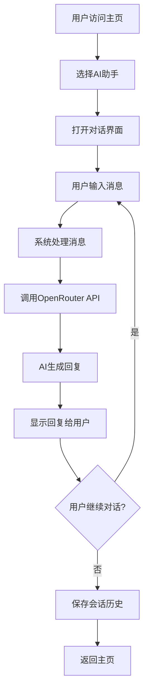
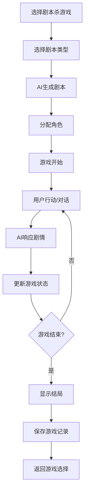

# 🛠️ AI智能工作台功能设计文档

## 📋 目录
1. [系统架构设计](#系统架构设计)
2. [AI助手功能设计](#ai助手功能设计)
3. [AI游戏功能设计](#ai游戏功能设计)
4. [API集成方案](#api集成方案)
5. [数据库设计](#数据库设计)
6. [用户交互流程](#用户交互流程)

---

## 🏗️ 系统架构设计

### 整体架构
```
┌─────────────────────────────────────────────────────────┐
│                    前端界面层                            │
├─────────────────┬─────────────────┬─────────────────────┤
│   AI助手界面    │    游戏界面     │      管理界面       │
│   (统一风格)    │   (独立设计)    │    (配置&用户)      │
├─────────────────┴─────────────────┴─────────────────────┤
│                    Flask路由层                          │
├─────────────────────────────────────────────────────────┤
│              业务逻辑层 (Services)                      │
│  ┌─────────────┬─────────────┬─────────────────────┐   │
│  │  AI服务     │   游戏服务   │     用户服务       │   │
│  │ (对话管理)  │ (角色&剧情)  │   (认证&记录)      │   │
│  └─────────────┴─────────────┴─────────────────────┘   │
├─────────────────────────────────────────────────────────┤
│                 OpenRouter API层                        │
│         (Gemini, Claude, GPT-4统一接口)                 │
├─────────────────────────────────────────────────────────┤
│                  数据持久层                             │
│  ┌─────────────┬─────────────┬─────────────────────┐   │
│  │   用户数据  │   对话历史   │    游戏存档        │   │
│  │  (SQLite)   │  (SQLite)   │    (SQLite)        │   │
│  └─────────────┴─────────────┴─────────────────────┘   │
└─────────────────────────────────────────────────────────┘
```

### 模块划分
```python
ai_assistant_platform/
├── services/                 # 业务逻辑层
│   ├── ai_service.py        # AI服务（OpenRouter集成）
│   ├── chat_service.py      # 对话管理服务
│   ├── game_service.py      # 游戏逻辑服务
│   └── user_service.py      # 用户管理服务
├── templates/               # 前端模板
│   ├── assistants/          # AI助手界面
│   ├── games/               # 游戏界面
│   └── common/              # 通用组件
├── static/                  # 静态资源
│   ├── css/                 # 样式文件
│   ├── js/                  # JavaScript文件
│   └── assets/              # 图片等资源
└── utils/                   # 工具函数
    ├── database.py          # 数据库操作
    └── helpers.py           # 辅助函数
```

---

## 🤖 AI助手功能设计

### 1. 统一对话系统

#### 核心组件
```python
class ChatService:
    def __init__(self):
        self.ai_service = AIService()
        self.memory_service = MemoryService()
    
    def process_message(self, assistant_type, message, session_id):
        """处理用户消息并生成回复"""
        # 获取助手配置
        assistant_config = self.get_assistant_config(assistant_type)
        
        # 构建对话上下文
        context = self.build_context(session_id, assistant_config)
        
        # 调用AI生成回复
        response = self.ai_service.chat_completion(context, message)
        
        # 保存对话记录
        self.save_conversation(session_id, message, response)
        
        return response
```

#### 助手类型配置
```python
ASSISTANT_CONFIGS = {
    "work_assistant": {
        "name": "工作助手",
        "icon": "💼",
        "system_prompt": """你是一个专业的工作助手，具备以下能力：
        - 任务规划和时间管理
        - 文档撰写和格式化
        - 会议纪要和总结
        - 项目管理建议
        
        请以专业、高效的方式协助用户完成工作任务。""",
        "theme_color": "#2E6CFB",
        "features": ["任务管理", "文档处理", "会议助手", "项目规划"]
    },
    
    "study_assistant": {
        "name": "学习助手", 
        "icon": "📚",
        "system_prompt": """你是一个耐心的学习助手，专注于：
        - 知识解答和概念解释
        - 学习方法指导
        - 技能提升建议
        - 学习计划制定
        
        请用通俗易懂的方式帮助用户学习和成长。""",
        "theme_color": "#10B981",
        "features": ["知识问答", "学习规划", "技能指导", "作业辅导"]
    },
    
    # ... 其他助手配置
}
```

### 2. 记忆系统设计

#### 短期记忆（会话级别）
- **对话历史**：保存当前会话的所有消息
- **上下文理解**：理解对话的连续性和语境
- **任务状态**：跟踪正在进行的任务进度

#### 长期记忆（用户级别）
- **个人偏好**：记住用户的使用习惯和偏好
- **历史任务**：保存完成的任务和项目信息
- **学习进度**：跟踪用户的学习历程和成果

```python
class MemoryService:
    def build_context(self, session_id, assistant_type):
        """构建包含记忆的对话上下文"""
        # 获取短期记忆（当前会话）
        recent_messages = self.get_recent_messages(session_id, limit=10)
        
        # 获取长期记忆（相关历史）
        relevant_history = self.get_relevant_history(assistant_type, limit=5)
        
        # 获取个人偏好
        user_preferences = self.get_user_preferences()
        
        return {
            "recent_context": recent_messages,
            "relevant_history": relevant_history,
            "user_preferences": user_preferences
        }
```

---

## 🎮 AI游戏功能设计

### 1. 🎭 AI剧本杀主持人

#### 游戏流程设计
```python
class ScriptHostGame:
    def __init__(self):
        self.game_state = {
            "phase": "preparation",  # preparation, role_assignment, gameplay, deduction, voting
            "players": [],
            "script": None,
            "clues": [],
            "timeline": [],
            "votes": {}
        }
    
    def start_game(self, script_type="modern_campus"):
        """开始游戏"""
        # 1. 生成剧本
        script = self.generate_script(script_type)
        
        # 2. 分配角色
        roles = self.assign_roles(script)
        
        # 3. 初始化游戏状态
        self.game_state.update({
            "phase": "role_assignment",
            "script": script,
            "players": roles
        })
        
        return self.get_game_intro()
    
    def generate_script(self, script_type):
        """AI生成剧本"""
        prompt = f"""
        生成一个{script_type}题材的剧本杀案件，包含：
        1. 案件背景和时间线
        2. 受害者信息和死因
        3. 5-6个角色的基本信息和动机
        4. 关键线索分布
        5. 真相和推理路径
        
        要求剧情合理，逻辑清晰，具有足够的推理性。
        """
        
        return self.ai_service.generate_content(prompt)
```

#### 界面组件设计
```html
<!-- 剧本杀游戏界面 -->
<div class="script-host-game">
    <!-- 游戏头部 -->
    <header class="game-header script-theme">
        <div class="game-title">
            <h2>🎭 AI剧本杀主持人</h2>
            <span class="game-phase">{{ game_state.phase }}</span>
        </div>
        <div class="game-controls">
            <button class="btn-notes">📝 笔记</button>
            <button class="btn-timeline">⏰ 时间线</button>
            <button class="btn-clues">🔍 线索</button>
        </div>
    </header>
    
    <!-- 角色展示区 -->
    <section class="roles-panel">
        <h3>角色信息</h3>
        <div class="role-cards">
            
            <div class="role-card {{ 'dead' if role.is_dead }}">
                <div class="role-avatar">{{ role.icon }}</div>
                <div class="role-info">
                    <h4>{{ role.name }}</h4>
                    <p>{{ role.description }}</p>
                </div>
                <div class="role-status">
                    
                    <span class="status-dead">💀 已死亡</span>
                    
                    <span class="status-alive">❤️ 存活</span>
                    
                </div>
            </div>
            
        </div>
    </section>
    
    <!-- 剧情对话区 -->
    <section class="story-dialogue">
        <div class="dialogue-container">
            
            <div class="dialogue-bubble {{ message.speaker_type }}">
                <div class="speaker-info">
                    <span class="speaker-icon">{{ message.icon }}</span>
                    <span class="speaker-name">{{ message.speaker }}</span>
                </div>
                <div class="message-content">{{ message.content }}</div>
            </div>
            
        </div>
    </section>
    
    <!-- 用户操作区 -->
    <section class="user-actions">
        <div class="action-buttons">
            <button class="action-btn investigate">🔍 调查线索</button>
            <button class="action-btn question">❓ 询问角色</button>
            <button class="action-btn accuse">👉 指控某人</button>
            <button class="action-btn vote">🗳️ 发起投票</button>
        </div>
        
        <div class="message-input">
            <textarea placeholder="输入你的行动或对话..."></textarea>
            <button class="send-btn">发送</button>
        </div>
    </section>
</div>
```

### 2. 🔍 AI推理侦探游戏

#### 游戏机制设计
```python
class DetectiveGame:
    def __init__(self):
        self.case_info = {}
        self.suspects = []
        self.evidence = []
        self.interrogation_history = {}
        self.deduction_points = 0
    
    def generate_case(self, case_type="murder"):
        """生成案件"""
        prompt = f"""
        生成一个{case_type}案件，包含：
        1. 案件概述（时间、地点、受害者）
        2. 现场情况和初步证据
        3. 3-5个嫌疑人，每人都有动机和不在场证明
        4. 隐藏线索和矛盾点
        5. 真相解析和推理路径
        
        要求：逻辑严密，有足够的推理难度，嫌疑人个性鲜明。
        """
        
        case = self.ai_service.generate_content(prompt)
        self.case_info = self.parse_case_info(case)
        self.suspects = self.create_suspects(case)
        
        return self.case_info
    
    def interrogate_suspect(self, suspect_id, question):
        """审问嫌疑人"""
        suspect = self.get_suspect(suspect_id)
        
        # AI扮演嫌疑人回答
        response = self.ai_service.roleplay_response(
            character=suspect,
            question=question,
            context=self.case_info,
            previous_interrogation=self.interrogation_history.get(suspect_id, [])
        )
        
        # 记录审问历史
        self.interrogation_history[suspect_id].append({
            "question": question,
            "answer": response,
            "timestamp": datetime.now()
        })
        
        # 检查是否发现矛盾
        contradictions = self.detect_contradictions(suspect_id, response)
        
        return {
            "response": response,
            "contradictions": contradictions,
            "new_clues": self.extract_clues(response)
        }
```

#### 审问界面设计
```html
<!-- 推理侦探游戏界面 -->
<div class="detective-game">
    <!-- 案件信息栏 -->
    <header class="case-header detective-theme">
        <div class="case-title">
            <h2>🔍 {{ case_info.title }}</h2>
            <p>{{ case_info.location }} · {{ case_info.time }}</p>
        </div>
        <div class="investigation-score">
            <span>推理分数: {{ deduction_points }}</span>
        </div>
    </header>
    
    <!-- 嫌疑人选择区 -->
    <section class="suspects-panel">
        <h3>嫌疑人列表</h3>
        <div class="suspect-tabs">
            
            <div class="suspect-tab {{ 'active' if suspect.id == current_suspect_id }}" 
                 onclick="selectSuspect('{{ suspect.id }}')">
                <div class="suspect-avatar">{{ suspect.icon }}</div>
                <div class="suspect-info">
                    <h4>{{ suspect.name }}</h4>
                    <p>{{ suspect.occupation }}</p>
                    <div class="suspicion-level">
                        <span class="level-{{ suspect.suspicion_level }}">
                            嫌疑度: {{ suspect.suspicion_level }}/5
                        </span>
                    </div>
                </div>
            </div>
            
        </div>
    </section>
    
    <!-- 审问对话区 -->
    <section class="interrogation-area">
        <div class="current-suspect-info">
            <div class="suspect-portrait">
                
                <h3>{{ current_suspect.name }}</h3>
                <p>{{ current_suspect.background }}</p>
            </div>
        </div>
        
        <div class="dialogue-history">
            
            <div class="dialogue-exchange">
                <div class="detective-question">
                    <span class="speaker">🕵️ 侦探:</span>
                    <span class="message">{{ exchange.question }}</span>
                </div>
                <div class="suspect-answer">
                    <span class="speaker">{{ current_suspect.icon }} {{ current_suspect.name }}:</span>
                    <span class="message">{{ exchange.answer }}</span>
                    
                    <div class="contradictions">
                        ⚠️ 发现矛盾: {{ exchange.contradictions }}
                    </div>
                    
                </div>
            </div>
            
        </div>
        
        <div class="question-input">
            <div class="quick-questions">
                <button class="quick-btn">你当时在哪里？</button>
                <button class="quick-btn">你认识受害者吗？</button>
                <button class="quick-btn">你有不在场证明吗？</button>
            </div>
            <div class="custom-question">
                <textarea placeholder="输入你的问题..."></textarea>
                <button class="ask-btn">询问</button>
            </div>
        </div>
    </section>
    
    <!-- 证据面板 -->
    <aside class="evidence-panel">
        <h3>🔍 证据清单</h3>
        <div class="evidence-list">
            
            <div class="evidence-item">
                <div class="evidence-icon">{{ evidence.icon }}</div>
                <div class="evidence-info">
                    <h4>{{ evidence.name }}</h4>
                    <p>{{ evidence.description }}</p>
                </div>
            </div>
            
        </div>
        
        <div class="deduction-area">
            <h3>🧠 推理结论</h3>
            <textarea placeholder="记录你的推理过程..."></textarea>
            <button class="submit-deduction">提交推理</button>
        </div>
    </aside>
</div>
```

### 3. 🐺 AI狼人杀法官

#### 游戏状态管理
```python
class WerewolfGame:
    def __init__(self):
        self.game_state = {
            "phase": "preparation",  # preparation, night, day, voting, game_over
            "day_count": 0,
            "players": [],
            "alive_players": [],
            "dead_players": [],
            "votes": {},
            "night_actions": {}
        }
        
        self.roles = {
            "werewolf": {"name": "狼人", "team": "wolf", "ability": "kill"},
            "villager": {"name": "村民", "team": "village", "ability": "none"},
            "seer": {"name": "预言家", "team": "village", "ability": "investigate"},
            "doctor": {"name": "医生", "team": "village", "ability": "heal"},
            "hunter": {"name": "猎人", "team": "village", "ability": "revenge"}
        }
    
    def start_game(self, player_count=8):
        """开始游戏"""
        # 分配角色
        roles = self.assign_roles(player_count)
        
        # 创建AI玩家
        players = self.create_ai_players(roles)
        
        self.game_state.update({
            "phase": "night",
            "day_count": 1,
            "players": players,
            "alive_players": [p for p in players if p["alive"]]
        })
        
        return self.get_game_start_message()
    
    def night_phase(self):
        """夜晚阶段"""
        actions = {}
        
        # 狼人杀人
        wolf_target = self.ai_wolf_action()
        actions["kill"] = wolf_target
        
        # 预言家查验
        if self.has_alive_role("seer"):
            seer_target = self.ai_seer_action()
            actions["investigate"] = seer_target
        
        # 医生救人
        if self.has_alive_role("doctor"):
            doctor_target = self.ai_doctor_action()
            actions["heal"] = doctor_target
        
        # 解析夜晚结果
        result = self.resolve_night_actions(actions)
        
        self.game_state["phase"] = "day"
        return result
    
    def day_phase(self):
        """白天阶段 - AI玩家发言"""
        speeches = []
        
        for player in self.game_state["alive_players"]:
            speech = self.generate_ai_speech(player)
            speeches.append({
                "player": player,
                "content": speech
            })
        
        return speeches
    
    def generate_ai_speech(self, player):
        """生成AI玩家发言"""
        prompt = f"""
        你是狼人杀游戏中的{player['role']}，名字是{player['name']}。
        当前是第{self.game_state['day_count']}天，昨晚{self.get_night_summary()}。
        
        请根据你的身份和当前局势发言：
        1. 如果你是狼人，要隐藏身份，误导村民
        2. 如果你是村民，要寻找狼人的破绽
        3. 如果你是神职，要合理使用信息
        
        发言要符合角色性格：{player['personality']}
        """
        
        return self.ai_service.generate_speech(prompt, player)
```

#### 狼人杀界面设计
```html
<!-- 狼人杀游戏界面 -->
<div class="werewolf-game">
    <!-- 游戏状态栏 -->
    <header class="game-status werewolf-theme">
        <div class="phase-indicator">
            <span class="phase-icon">{{ phase_icon }}</span>
            <span class="phase-text">{{ current_phase }}</span>
            <span class="day-counter">第 {{ day_count }} 天</span>
        </div>
        <div class="team-status">
            <span class="wolf-count">🐺 {{ wolf_count }}</span>
            <span class="village-count">👥 {{ village_count }}</span>
        </div>
    </header>
    
    <!-- 玩家状态区域 -->
    <section class="players-area">
        <div class="players-grid">
            
            <div class="player-card {{ 'dead' if not player.alive }} {{ 'highlight' if player.is_speaking }}">
                <div class="player-avatar">
                    
                    
                    <div class="death-overlay">💀</div>
                    
                </div>
                <div class="player-info">
                    <h4>{{ player.name }}</h4>
                    <p class="player-number">{{ player.position }}号</p>
                    
                    <p class="death-role">{{ player.revealed_role }}</p>
                    
                </div>
                <div class="player-actions">
                    
                    <button class="vote-btn" onclick="votePlayer('{{ player.id }}')">
                        投票
                    </button>
                    
                </div>
            </div>
            
        </div>
    </section>
    
    <!-- 游戏日志区域 -->
    <section class="game-log">
        <div class="log-tabs">
            <button class="tab-btn active" data-tab="speeches">💬 发言</button>
            <button class="tab-btn" data-tab="actions">🌙 夜晚</button>
            <button class="tab-btn" data-tab="votes">🗳️ 投票</button>
        </div>
        
        <div class="log-content">
            <div class="log-tab speeches active">
                
                <div class="speech-item">
                    <div class="speaker-info">
                        <span class="speaker-avatar">{{ speech.player.avatar }}</span>
                        <span class="speaker-name">{{ speech.player.name }}</span>
                        <span class="speech-time">{{ speech.timestamp }}</span>
                    </div>
                    <div class="speech-content">{{ speech.content }}</div>
                </div>
                
            </div>
            
            <div class="log-tab actions">
                
                <div class="action-item">
                    <span class="action-icon">{{ action.icon }}</span>
                    <span class="action-text">{{ action.description }}</span>
                </div>
                
            </div>
            
            <div class="log-tab votes">
                
                <div class="vote-item">
                    <div class="vote-summary">{{ vote_result.summary }}</div>
                    <div class="vote-details">{{ vote_result.details }}</div>
                </div>
                
            </div>
        </div>
    </section>
    
    <!-- 用户操作区 -->
    <section class="user-controls">
        
        <div class="speech-input">
            <textarea placeholder="输入你的发言内容..."></textarea>
            <button class="speak-btn">🗣️ 发言</button>
        </div>
        
        <div class="voting-controls">
            <h3>投票阶段</h3>
            <p>请选择你要投票的玩家</p>
            <div class="vote-buttons">
                
                <button class="vote-option" onclick="submitVote('{{ player.id }}')">
                    投票给 {{ player.name }}
                </button>
                
            </div>
        </div>
        
        <div class="night-info">
            <h3>🌙 夜晚降临</h3>
            <p>天黑请闭眼，等待天亮...</p>
            <div class="night-timer">
                <span id="night-countdown">30</span> 秒后天亮
            </div>
        </div>
        
    </section>
</div>
```

---

## 🔌 API集成方案

### OpenRouter服务封装
```python
class OpenRouterService:
    def __init__(self, api_key):
        self.api_key = api_key
        self.base_url = "https://openrouter.ai/api/v1"
        self.available_models = {
            "gemini-pro": "google/gemini-2.5-pro",
            "gemini-flash": "google/gemini-2.5-flash",
            "claude-opus": "anthropic/claude-opus-4",
            "gpt-4": "openai/gpt-4.1"
        }
    
    def chat_completion(self, model, messages, stream=False):
        """聊天完成"""
        headers = {
            "Authorization": f"Bearer {self.api_key}",
            "Content-Type": "application/json"
        }
        
        data = {
            "model": self.available_models.get(model, model),
            "messages": messages,
            "stream": stream,
            "temperature": 0.7,
            "max_tokens": 2000
        }
        
        response = requests.post(
            f"{self.base_url}/chat/completions",
            headers=headers,
            json=data,
            stream=stream
        )
        
        if stream:
            return self._handle_stream_response(response)
        else:
            return response.json()
    
    def generate_content(self, prompt, model="gemini-pro"):
        """生成内容（适用于游戏剧本生成）"""
        messages = [{"role": "user", "content": prompt}]
        return self.chat_completion(model, messages)
```

### 模型选择策略
```python
MODEL_USAGE_MAP = {
    "chat": {
        "default": "gemini-flash",      # 快速响应
        "complex": "gemini-pro",        # 复杂任务
        "creative": "claude-opus"       # 创意任务
    },
    "game": {
        "script_generation": "claude-opus",    # 剧本创作
        "character_roleplay": "gemini-pro",    # 角色扮演
        "logic_reasoning": "gpt-4"             # 逻辑推理
    }
}
```

---

## 💾 数据库设计

### 数据表结构
```sql
-- 用户表
CREATE TABLE users (
    id INTEGER PRIMARY KEY AUTOINCREMENT,
    username VARCHAR(50) UNIQUE NOT NULL,
    email VARCHAR(100),
    password_hash VARCHAR(255),
    created_at TIMESTAMP DEFAULT CURRENT_TIMESTAMP,
    last_login TIMESTAMP
);

-- 会话表
CREATE TABLE conversations (
    id VARCHAR(36) PRIMARY KEY,  -- UUID
    user_id INTEGER,
    assistant_type VARCHAR(50),
    title VARCHAR(200),
    created_at TIMESTAMP DEFAULT CURRENT_TIMESTAMP,
    updated_at TIMESTAMP DEFAULT CURRENT_TIMESTAMP,
    FOREIGN KEY (user_id) REFERENCES users(id)
);

-- 消息表
CREATE TABLE messages (
    id INTEGER PRIMARY KEY AUTOINCREMENT,
    conversation_id VARCHAR(36),
    role VARCHAR(20),  -- user, assistant, system
    content TEXT,
    timestamp TIMESTAMP DEFAULT CURRENT_TIMESTAMP,
    metadata JSON,  -- 额外信息（模型、tokens等）
    FOREIGN KEY (conversation_id) REFERENCES conversations(id)
);

-- 游戏存档表
CREATE TABLE game_saves (
    id INTEGER PRIMARY KEY AUTOINCREMENT,
    user_id INTEGER,
    game_type VARCHAR(50),
    save_name VARCHAR(100),
    game_state JSON,  -- 游戏状态数据
    created_at TIMESTAMP DEFAULT CURRENT_TIMESTAMP,
    updated_at TIMESTAMP DEFAULT CURRENT_TIMESTAMP,
    FOREIGN KEY (user_id) REFERENCES users(id)
);

-- 用户偏好表
CREATE TABLE user_preferences (
    user_id INTEGER PRIMARY KEY,
    preferred_model VARCHAR(50),
    theme VARCHAR(20),
    language VARCHAR(10),
    settings JSON,
    FOREIGN KEY (user_id) REFERENCES users(id)
);
```

---

## 🔄 用户交互流程

### AI助手交互流程


### 游戏交互流程（以剧本杀为例）


---

## 📈 性能优化策略

### 1. API调用优化
- **缓存机制**：缓存常用的AI回复和游戏模板
- **异步处理**：使用异步请求避免界面阻塞
- **流式响应**：支持实时显示AI生成内容
- **请求队列**：管理并发请求，避免API限制

### 2. 前端性能优化
- **组件复用**：通用组件模块化设计
- **懒加载**：按需加载游戏界面和资源
- **本地存储**：缓存用户偏好和临时数据
- **响应式图片**：根据设备优化图片加载

### 3. 数据库优化
- **索引优化**：为常用查询添加索引
- **数据分页**：大量历史记录分页加载
- **定期清理**：清理过期的临时数据
- **备份策略**：定期备份重要数据

---

## 🔒 安全考虑

### 1. API安全
- **密钥管理**：安全存储和管理API密钥
- **请求限制**：防止API滥用和成本超支
- **错误处理**：妥善处理API错误和异常

### 2. 用户数据安全
- **密码加密**：使用强加密算法保护密码
- **会话管理**：安全的用户会话机制
- **数据隐私**：用户数据本地存储，不上传第三方

### 3. 内容安全
- **输入验证**：防止恶意输入和注入攻击
- **内容过滤**：过滤不当内容和敏感信息
- **访问控制**：适当的权限管理机制

---

## 🚀 部署方案

### 本地部署
```bash
# 环境准备
python -m venv venv
source venv/bin/activate  # Windows: venv\Scripts\activate
pip install -r requirements.txt

# 数据库初始化
python init_db.py

# 启动应用
python app.py
```

### Docker部署
```dockerfile
FROM python:3.9-slim

WORKDIR /app
COPY requirements.txt .
RUN pip install -r requirements.txt

COPY . .
EXPOSE 5000

CMD ["python", "app.py"]
```

这个功能设计文档提供了完整的技术实现方案，接下来我将创建界面设计文档来详细说明UI/UX设计。