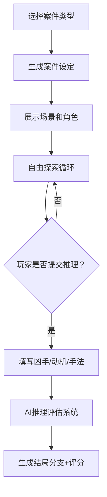

# AI推理侦探游戏详细开发与交互设计手册

---

## 🎮 游戏模式概述

### 名称：AI推理侦探游戏  
类型：文字互动类剧情推理游戏  
目标：通过线索收集、角色盘问、场景调查，推理出真相并提交结论。

---

## 🧠 一、游戏规则逻辑（核心流程）

### 1. 游戏开始
- 玩家选择案件主题（城市谋杀案 / 校园事件 / 古堡奇案等）
- AI生成剧情背景 + 角色列表 + 初始场景（用气氛渲染）

### 2. 信息展示
- 玩家初步了解：
  - 案件概况
  - 所有嫌疑人基本资料
  - 当前场景的描述
  - 死亡者信息（时间、地点、方式）

### 3. 玩家操作循环（自由探索阶段）
每一轮玩家可以执行以下动作（可按钮也可文字输入）：
- 🕵️ 调查场景（如：查看尸体、检查桌面、翻找垃圾桶）
- 💬 盘问角色（对话互动，角色会隐藏/欺骗/透露线索）
- 📓 分析笔记（查看自动记录的线索）
- ⏩ 推进时间线（进入下一个时间点或场景）

### 4. 线索积累与逻辑推理
- 玩家通过Notebook随时查看：
  - 当前已知线索
  - 角色间的矛盾陈述
  - 自己的分析/标注
- 可使用“头脑风暴”按钮，让AI协助整理推理脉络（非强提示）

### 5. 提交推理
玩家点击“提交推理”进入以下流程：
- 填写：凶手是谁？动机？作案手法？
- AI评估：
  - 逻辑完整性评分
  - 与真实答案对比的偏差分析
  - 给出结局分支与评语（S/A/B/C级破案等级）

---

## 📋 二、详细操作指南

| 操作名称       | 描述                                               | AI角色作用                                         |
| -------------- | -------------------------------------------------- | -------------------------------------------------- |
| 调查线索       | 自由点击场景或输入文字（如“检查地毯”）             | AI生成结果/添加新线索                              |
| 角色对话       | 与角色对话可采用输入文字或选项形式                 | AI模拟角色语气、性格、记忆与欺骗行为               |
| 提交推理       | 引导填写凶手、手法、动机等                         | AI校验推理逻辑，触发结局                           |
| 请求提示       | 可点击“提示”按钮获取轻度AI协助                     | AI提供可能的推理方向，但不直接给出答案             |
| 笔记与线索库   | 自动记录重要发现，可标记线索重要性                 | AI同步更新并生成关系图谱（如线索间连线）           |
| 时间推进       | 玩家触发，进入新场景或角色行为变化                 | AI更新场景背景、事件发生，角色反应逻辑调整         |

---

## 🧩 三、AI在不同场景中的参与逻辑

| 模块             | 任务描述                                                   | 模型行为示例                                           |
| ---------------- | ---------------------------------------------------------- | ------------------------------------------------------ |
| 剧情生成         | 创建完整案件框架、角色设定、动机链、时间线                 | “生成一宗图书馆谋杀案，受害人是校长，有5个嫌疑人”     |
| 角色扮演         | 模拟角色行为、对话、态度变化                               | “我质问张三”→ 张三以撒谎口气回应：“我昨晚在家睡觉”     |
| 调查反馈         | 根据玩家调查请求生成反馈文字、图片、声音                   | “查看尸体”→ “你发现他手里握着一张照片”                 |
| 情绪与策略建模   | 保持角色逻辑一致、记忆前文信息、基于玩家表现动态反应       | 某角色因玩家怀疑过多而开始敌视并少说实话               |
| 推理评分         | 审查玩家提交的凶手与推理路径，进行逻辑分析并评分           | “凶手是李四”→ AI判断其动机与时间线不符 → C级评分      |

---

## 📆 四、完整游玩顺序流程图



---

## 🎨 五、UI页面与风格设计指南

### 主界面框架
```
+--------------------------------------------------------+
| Header（Logo + 游戏模式 + 菜单设置）                   |
+----------------------+---------------------------------+
| RolePanel            | SceneDisplay                   |
|（头像+状态）         |（当前场景描述+动态变化）         |
+----------------------+---------------------------------+
| Timeline / Notebook（标签切换）                        |
+--------------------------------------------------------+
| ChatBox（用户输入/AI回应） + ActionPanel（按钮）       |
+--------------------------------------------------------+
```

### UI 风格建议
- 主题色调：灰蓝+黑白线稿（突出侦探氛围）
- 字体：思源黑体 + 手写风格英文字体用于AI台词
- 对话气泡样式：
  - 玩家：左侧白底黑字，头像在左
  - AI角色：右侧灰底色，头像带边框、带角色名
  - 非常规台词（如提示、描述）：中间展示，浅黄背景

### 动作按钮样式
- 悬浮式圆角矩形
- 图标 + 动词：“🔍 调查”、“🗣 盘问”、“🧠 推理”、“⏭ 前进”

---

## 🗂 六、后端与AI调用逻辑建议

### 对话引擎
- 模型：OpenAI GPT-4o / Claude 3 / 自有模型
- prompt封装需包含：
  - 当前游戏状态（场景、线索、角色）
  - 用户发言历史
  - 当前目标或操作

### 状态缓存机制
- 使用 Redux/Zustand 等保持：
  - 玩家记录的线索
  - 角色当前状态与态度
  - 当前时间点与事件链进度

### 模型调用示例 Prompt
```
你正在扮演一个AI推理游戏中的嫌疑人李四。
背景：图书馆中发生了谋杀案，你是图书管理员。
性格：沉默寡言，害怕被怀疑，会撒谎掩盖事实。
当前被玩家质问你昨晚去向，你应该编造一个合理的谎言，同时避免过多暴露信息。
```

---

## 📌 七、附加玩法建议（可后期拓展）

- 多人协作版：两个玩家共同探案，与AI一起对抗谜题
- 事件库自动扩展：通过关键词生成剧本+逻辑链
- 语音版对话：调用TTS语音读出AI台词
- AI画像生成：每个角色由AI画图生成头像和线索图纸

---

## ✅ 开发建议顺序（推荐）

1. 开发“AI推理侦探”模式 Demo
2. 构建交互框架（对话+Action+线索管理）
3. 接入OpenAI或Claude模型处理角色扮演与反馈
4. 设计1-2个完整案件样本用于测试
5. 完善UI风格、动画、音效
6. 逐步扩展至剧本杀与狼人杀场景

---

> 本手册将帮助你构建一个富有沉浸感的AI推理互动游戏系统，可用于教学、娱乐、工具化扩展等多场景落地。
